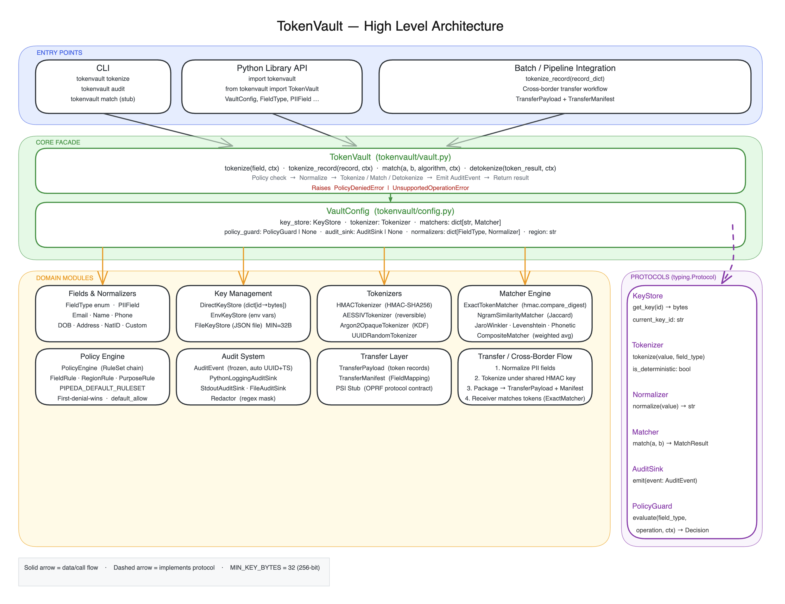

# TokenVault

A Python library for privacy-preserving tokenization and matching of personally identifiable information (PII), with first-class support for cross-border data transfer scenarios and PIPEDA compliance.

## Architecture

### High Level Design
> Open [`docs/diagrams/hld.excalidraw`](docs/diagrams/hld.excalidraw) in [Excalidraw](https://excalidraw.com) to view or edit. Replace the placeholder below with a screenshot after opening.

<!-- HLD_SCREENSHOT_PLACEHOLDER -->
<!--
  To add the screenshot:
  1. Open docs/diagrams/hld.excalidraw at https://excalidraw.com (drag & drop)
  2. Export as PNG  (Menu → Export image → PNG)
  3. Save to docs/diagrams/hld.png
  4. Replace this comment block with: 
-->

The system is structured in four layers:
- **Entry Points** — CLI (`tokenvault tokenize / audit`) and Python library API
- **Core Facade** — `TokenVault` orchestrates normalization → policy check → tokenization → audit; `VaultConfig` wires all components
- **Domain Modules** — Fields & Normalizers · Key Management · Tokenizers · Matcher Engine · Policy Engine · Audit System · Transfer Layer
- **Protocols** — `typing.Protocol` ABCs (`KeyStore`, `Tokenizer`, `Normalizer`, `Matcher`, `AuditSink`, `PolicyGuard`) decouple every domain from the others

### Low Level Design
> Open [`docs/diagrams/lld.excalidraw`](docs/diagrams/lld.excalidraw) in [Excalidraw](https://excalidraw.com) to view or edit. Replace the placeholder below with a screenshot after opening.

<!-- LLD_SCREENSHOT_PLACEHOLDER -->
<!--
  To add the screenshot:
  1. Open docs/diagrams/lld.excalidraw at https://excalidraw.com (drag & drop)
  2. Export as PNG  (Menu → Export image → PNG)
  3. Save to docs/diagrams/lld.png
  4. Replace this comment block with: 
-->

The LLD covers:
- **Protocol Layer** — all six `typing.Protocol` interfaces with method signatures
- **Value Types** — `TokenResult`, `MatchResult`, `AuditEvent` (auto UUID + UTC timestamp, `MappingProxyType` metadata), `PolicyDecision` — all frozen dataclasses
- **Concrete Implementations** — full implementation list per domain with algorithm notes
- **`vault.tokenize()` call flow** — Receive → Policy Check → Normalize → Tokenize → Emit Audit → Return
- **Security invariants** — `hmac.compare_digest`, `secrets`-only randomness, 256-bit key floor, no PII in logs

## Features

- **Deterministic tokenization** via HMAC-SHA256 — same input always produces the same token
- **Non-deterministic tokenization** via UUID (opaque references) and Argon2id
- **Format-preserving encryption** via AES-SIV (reversible, policy-gated)
- **Fuzzy matching** — exact, n-gram similarity, Jaro-Winkler, Levenshtein, phonetic, and composite matchers
- **Built-in normalizers** for email, name, phone, address, date of birth, and national ID fields
- **PIPEDA compliance** via a rule-based policy engine with purpose declaration enforcement
- **Audit trail** — structured events emitted after every tokenization and match operation; no raw PII ever appears in logs
- **Cross-border transfer utilities** — `TransferPayload` and `TransferManifest` for PIPEDA-compliant data transfers
- **CLI** for batch tokenization of CSV files
- **Zero required runtime dependencies** — core path uses stdlib only (Python >= 3.10)

## Installation

```bash
pip install tokenvault
```

With optional extras:

```bash
pip install 'tokenvault[cli]'       # CSV tokenization CLI (tomli backport for Python 3.10)
pip install 'tokenvault[argon2]'    # Argon2id tokenizer
pip install 'tokenvault[aes-siv]'   # AES-SIV format-preserving encryption
pip install 'tokenvault[fuzzy]'     # Jaro-Winkler, Levenshtein, Soundex, Metaphone matchers
pip install 'tokenvault[phone]'     # E.164 phone normalizer
pip install 'tokenvault[all]'       # All optional extras
```

## Quickstart

```python
import secrets
import tokenvault as tv
from tokenvault.keys.direct import DirectKeyStore
from tokenvault.tokenizers.hmac_sha256 import HMACTokenizer
from tokenvault.matchers.exact import ExactTokenMatcher

# 1. Create a key store with a 256-bit key
key = secrets.token_bytes(32)
store = DirectKeyStore(keys={"v1": key}, current_key_id="v1")

# 2. Build a vault
vault = tv.TokenVault(tv.VaultConfig(
    key_store=store,
    tokenizer=HMACTokenizer(key_store=store),
    matchers={"exact": ExactTokenMatcher()},
))

# 3. Tokenize a PII field
field = tv.PIIField(name="email", field_type=tv.FieldType.EMAIL, value="user@example.com")
result = vault.tokenize(field)
# result.token       → deterministic HMAC-SHA256 token (base64url, no padding)
# result.is_deterministic → True
# result.key_version → "v1"

# 4. Same input always produces the same token
result2 = vault.tokenize(field)
assert result.token == result2.token

# 5. Match two tokens
match = vault.match(result, result2, algorithm="exact")
assert match.matched is True
```

## Key Management

### DirectKeyStore

Pass raw key material directly. Useful for testing and environments where you manage key rotation externally.

```python
from tokenvault.keys.direct import DirectKeyStore
import secrets

store = DirectKeyStore(
    keys={"v1": secrets.token_bytes(32)},
    current_key_id="v1",
)
```

All keys must be at least 32 bytes (256 bits). A `KeyEntropyError` is raised if a key is shorter.

### EnvKeyStore

Load keys from environment variables. Suitable for containerized deployments.

```python
from tokenvault.keys.env import EnvKeyStore

# Expects TOKENVAULT_KEY_<ID> environment variables, e.g. TOKENVAULT_KEY_V1
store = EnvKeyStore()
```

### FileKeyStore

Load keys from a key file on disk.

```python
from tokenvault.keys.file import FileKeyStore

store = FileKeyStore(path="/run/secrets/tokenvault.keys")
```

## Normalizers

Normalize PII fields before tokenization to ensure consistent tokens regardless of formatting differences.

```python
from tokenvault.fields.email import EmailNormalizer
from tokenvault.fields.name import NameNormalizer
from tokenvault.fields.phone import PhoneNormalizer
from tokenvault.fields.dob import DateOfBirthNormalizer
from tokenvault.fields.address import AddressNormalizer
from tokenvault.fields.national_id import NationalIDNormalizer

email_norm = EmailNormalizer()
email_norm.normalize("User+tag@Example.COM")  # → "user@example.com"

name_norm = NameNormalizer()
name_norm.normalize("JANE  SMITH")  # → "jane smith"
```

## Tokenization Strategies

### HMAC-SHA256 (deterministic, default)

```python
from tokenvault.tokenizers.hmac_sha256 import HMACTokenizer

tokenizer = HMACTokenizer(key_store=store)
```

- Deterministic: the same `(value, field_type)` pair always produces the same token
- Domain-separated: tokens for `email` and `name` fields with the same raw value are always different
- Uses `hmac.compare_digest` for all token comparisons (timing-safe)

### UUID Random (non-deterministic, opaque reference)

```python
from tokenvault.tokenizers.uuid_random import UUIDRandomTokenizer

tokenizer = UUIDRandomTokenizer()
```

- Non-deterministic: each call produces a new UUIDv4 token
- Use when you need opaque references rather than linkable tokens

### Argon2id (non-deterministic, truly irreversible)

Requires `pip install 'tokenvault[argon2]'`.

```python
from tokenvault.tokenizers.argon2_opaque import Argon2OpaqueTokenizer

tokenizer = Argon2OpaqueTokenizer(key_store=store)
```

### AES-SIV (format-preserving, reversible)

Requires `pip install 'tokenvault[aes-siv]'`. Intended only for use cases where decryption is required under explicit policy authorization.

```python
from tokenvault.tokenizers.aes_siv import AESSIVTokenizer

tokenizer = AESSIVTokenizer(key_store=store)
```

## Matching

### Exact Match

```python
from tokenvault.matchers.exact import ExactTokenMatcher

matcher = ExactTokenMatcher()
result = matcher.match(token_a, token_b)
# result.matched → True / False
# result.score   → 1.0 or 0.0
```

### N-gram Similarity

```python
from tokenvault.matchers.ngram import NgramSimilarityMatcher

matcher = NgramSimilarityMatcher(n=2, threshold=0.7)
```

### Composite (weighted multi-algorithm)

```python
from tokenvault.matchers.composite import CompositeMatcher, WeightedMatcher
from tokenvault.matchers.exact import ExactTokenMatcher
from tokenvault.matchers.ngram import NgramSimilarityMatcher

matcher = CompositeMatcher([
    WeightedMatcher(ExactTokenMatcher(), weight=0.4),
    WeightedMatcher(NgramSimilarityMatcher(n=2), weight=0.6),
], threshold=0.5)
```

Weights must sum to 1.0. The composite score is a weighted average of the individual scores.

### Jaro-Winkler, Levenshtein, Phonetic

Requires `pip install 'tokenvault[fuzzy]'`.

```python
from tokenvault.matchers.jaro_winkler import JaroWinklerMatcher
from tokenvault.matchers.levenshtein import LevenshteinMatcher
from tokenvault.matchers.phonetic import SoundexMatcher, MetaphoneMatcher
```

## PIPEDA Policy Engine

Enforce purpose-based access control before tokenization or matching.

```python
from tokenvault.policy.pipeda import PIPEDA_DEFAULT_RULESET
from tokenvault.policy.engine import PolicyEngine
import tokenvault as tv

engine = PolicyEngine([PIPEDA_DEFAULT_RULESET])
vault = tv.TokenVault(tv.VaultConfig(
    key_store=store,
    tokenizer=tokenizer,
    policy_guard=engine,
))

# Tokenization without a declared purpose raises PolicyDeniedError
try:
    vault.tokenize(field, context={})
except tv.PolicyDeniedError:
    pass  # denied: no purpose declared

# With a valid purpose, tokenization proceeds
result = vault.tokenize(field, context={"purpose": "data_transfer"})
```

`PIPEDA_DEFAULT_RULESET` requires the context to declare `purpose="data_transfer"` and allows the standard operations `tokenize`, `match`, and `transfer` on all built-in field types.

### Custom Rules

```python
from tokenvault.policy.engine import PolicyEngine, RuleSet
from tokenvault.policy.rules import FieldRule, PurposeRule, RegionRule

ruleset = RuleSet(
    rules=[
        FieldRule("email", allowed_operations=frozenset({"tokenize", "match"})),
        PurposeRule(required_purpose="data_transfer"),
        RegionRule(origin_region="CA", allowed_destinations=frozenset({"US", "UK"})),
    ],
    default_allow=False,
)
engine = PolicyEngine([ruleset])
```

## Audit Sinks

Every tokenization and match operation emits an `AuditEvent`. Raw PII never appears in audit output.

### Python Logging (default)

```python
from tokenvault.audit.sinks.logging import PythonLoggingAuditSink

sink = PythonLoggingAuditSink()  # emits to the "tokenvault.audit" logger
```

### Stdout

```python
from tokenvault.audit.sinks.stdout import StdoutAuditSink

sink = StdoutAuditSink()  # prints JSON lines to stdout
```

### File (JSONL)

```python
from tokenvault.audit.sinks.file import FileAuditSink

sink = FileAuditSink(path="/var/log/tokenvault/audit.jsonl")
```

### Custom Sink

Implement the `AuditSink` protocol (a single `emit(event: AuditEvent) -> None` method):

```python
import tokenvault as tv

class MyAuditSink:
    def emit(self, event: tv.AuditEvent) -> None:
        # ship to SIEM, write to database, etc.
        ...
```

## Cross-Border Transfer

Build transfer payloads and manifests for PIPEDA-compliant data transfers. No raw PII is ever included.

```python
from tokenvault.transfer.payload import TransferPayload
from tokenvault.transfer.manifest import FieldMapping, TransferManifest
from tokenvault.fields.email import EmailNormalizer
import tokenvault as tv

email_norm = EmailNormalizer()
record = {
    "email": tv.PIIField("email", tv.FieldType.EMAIL, email_norm.normalize("user@example.com")),
}
tokens = vault.tokenize_record(record, context={"purpose": "data_transfer"})

payload = TransferPayload()
payload.add_record(tokens)

manifest = TransferManifest(
    source_region="CA",
    destination_region="US",
    policy_id="pipeda-default",
    consent_reference="consent-ref-001",
    field_mappings=[
        FieldMapping(
            field_name=k,
            field_type=v.field_type,
            algorithm=v.algorithm,
            key_version=v.key_version,
        )
        for k, v in tokens.items()
    ],
)

print(payload.to_dict())    # {"records": [{"email": "<token>"}]}
print(manifest.to_dict())   # {"source_region": "CA", "destination_region": "US", ...}
```

## CLI Usage

Install the CLI extra:

```bash
pip install 'tokenvault[cli]'
```

### Tokenize a CSV of PII records

```bash
tokenvault tokenize --config policy.toml --input records.csv --output tokens.csv
```

The TOML config maps column names to field types:

```toml
[fields]
email = "email"
first_name = "name"
phone = "phone"
```

Keys are loaded from environment variables (`TOKENVAULT_KEY_<ID>`).

### Match two tokenized datasets

```bash
tokenvault match --config policy.toml --left a.csv --right b.csv --fields name,email
```

### Query an audit log

```bash
tokenvault audit --log audit.jsonl
```

## Public API

The following symbols are exported from `tokenvault` directly:

| Symbol | Description |
|---|---|
| `TokenVault` | Main facade for tokenization and matching |
| `VaultConfig` | Configuration dataclass for `TokenVault` |
| `PolicyDeniedError` | Raised when a policy guard denies an operation |
| `FieldType` | Enum of supported PII field types |
| `PIIField` | Immutable dataclass representing a PII field (value is redacted in `repr`) |
| `TokenResult` | Result dataclass from a tokenization operation |
| `MatchResult` | Result dataclass from a match operation |
| `AuditEvent` | Structured audit event emitted after each operation |
| `PolicyDecision` | Result dataclass from a policy evaluation |
| `KeyEntropyError` | Raised when a key does not meet 256-bit minimum entropy |
| `__version__` | Library version string |

## Security Model

- **No raw PII in logs, exceptions, or any output.** `PIIField.__repr__` returns `[REDACTED]` for the value. `AuditEvent` fields contain only tokens, field types, algorithms, and outcome codes.
- **All token comparisons use `hmac.compare_digest`** to prevent timing attacks.
- **Minimum key length is 32 bytes (256 bits).** `KeyEntropyError` is raised on shorter keys.
- **Domain separation** in HMAC tokenization: the message is `"<field_type>:<value>"`, so tokens for the same raw value in different field types are always distinct.
- **No required runtime dependencies** — the core path (HMAC-SHA256 tokenizer, exact matcher, direct key store) uses only Python stdlib.

## Contributing

1. Fork the repository and create a feature branch.
2. Run the test suite: `pytest --tb=short -q`
3. All tests must pass with zero warnings.
4. No real PII may be committed to the repository. Use programmatically generated synthetic data in tests.

## Documentation

| Document | Description |
|---|---|
| [`docs/SPEC.md`](docs/SPEC.md) | Product and engineering specification — purpose, requirements, acceptance criteria |
| [`docs/superpowers/specs/2026-10-04-tokenvault-architecture-design.md`](docs/superpowers/specs/2026-10-04-tokenvault-architecture-design.md) | Architecture design — package structure, protocol definitions, algorithm choices |
| [`docs/superpowers/plans/2026-10-04-tokenvault-implementation.md`](docs/superpowers/plans/2026-10-04-tokenvault-implementation.md) | TDD implementation plan |
| [`docs/diagrams/hld.excalidraw`](docs/diagrams/hld.excalidraw) | High Level Architecture diagram (Excalidraw) |
| [`docs/diagrams/lld.excalidraw`](docs/diagrams/lld.excalidraw) | Low Level Design diagram (Excalidraw) |

## License

MIT
